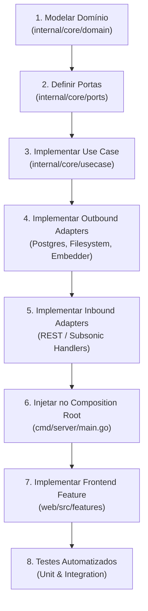

# Harmoni - Guia Operacional e Protocolo para Agentes de IA (AGENTS.md)

Este documento é o manual de instruções obrigatório para qualquer Agente de IA (ou desenvolvedor) encarregado de criar, refatorar, testar ou expandir funcionalidades no repositório **Harmoni**.

---

## 1. Visão Técnica e Filosofia do Projeto

O **Harmoni** é um servidor de streaming de música self-hosted, ultraeficiente e inteligente.

### Nossos Pilares:
* **Backend:** Go 1.26+ usando exclusivamente a biblioteca padrão (`net/http` nativo). Zero dependência de frameworks web pesados (como Gin, Echo ou Fiber).
* **Banco de Dados:** PostgreSQL 16+/17+ com a extensão `pgvector` para busca vetorial por similaridade de cosseno (Rádio Inteligente).
* **Frontend:** React + TypeScript + Vite compilado em SPA estática e embutido no binário Go com `go:embed`.
* **Zero Node.js em Produção:** O container final nunca roda runtime Node.js.
* **Consumo de Memória:** O backend deve permanecer estritamente abaixo de **35 MB de RAM** em repouso.
* **Streaming Direto:** *Zero transcoding em tempo real*. Usamos `http.ServeContent` para responder nativamente a requisições `Range: bytes=X-Y` com código HTTP `206 Partial Content`.

---

## 2. As 7 Regras Inegociáveis de Arquitetura (Guardrails)

Ao implementar qualquer código, o agente **DEVE** obedecer às seguintes regras:

1. **Isolamento Absoluto do Domínio:**  
   O pacote `internal/core/domain/` **NUNCA** pode importar pacotes de infraestrutura (`net/http`, `database/sql`, `github.com/jackc/pgx`, `os/exec`). O domínio é código Go puro contendo entidades, value objects e validações invariantes.
2. **Contratos Explícitos nas Portas (ISP):**  
   Todo caso de uso e repositório deve ter sua interface definida em `internal/core/ports/`. Crie interfaces pequenas e específicas (`TrackReader`, `TrackWriter`), evitando interfaces inchadas ("God interfaces").
3. **Zero Transcoding no Streaming:**  
   Nunca tente decodificar ou transcodificar faixas de áudio em tempo real na rota de stream. O arquivo original (`mp3`, `flac`, `m4a`, `opus`) é transmitido diretamente via `io.ReadSeekCloser` com `http.ServeContent`.
4. **Downloads Throttled (Single-Worker):**  
   Chamadas para ferramentas pesadas como `yt-dlp` e `ffmpeg` **NUNCA** devem ser disparadas livremente em goroutines avulsas. Devem ser sempre enfileiradas em um canal Go com buffer controlado e processadas por um único worker executando com `nice -n 19`.
5. **Segurança de Arquivos e Execução de Processos:**  
   - Sempre utilize `filepath.Clean` e valide que o caminho final reside dentro do diretório raiz permitido de mídia para prevenir ataques de *Directory Traversal*.
   - Sanitizar estritamente strings e URLs externas enviadas a comandos de SO para evitar *Command Injection*.
6. **Frontend Offline-First:**  
   O player no frontend deve sempre consultar a store `offline_tracks` no `IndexedDB` antes de efetuar uma chamada de rede. Se a música existir localmente, cria-se `URL.createObjectURL(blob)` para reprodução sem tráfego de rede.
7. **Logging Estruturado e Contexto:**  
   Utilize sempre `log/slog` da biblioteca padrão do Go. Todo método de caso de uso, repositório ou serviço externo deve receber `ctx context.Context` como primeiro parâmetro.

---

## 3. Checklist Passo a Passo: Como Implementar Qualquer Nova Feature

Siga rigorosamente esta ordem ao criar uma nova funcionalidade:



### Passo 1: Domínio (`internal/core/domain/<subdomain>/`)
* Crie as structs de entidade e tipos de identificador (ex.: `type TrackID string`).
* Escreva os construtores que validam as invariantes de negócio (ex.: `NewTrack(...) (*Track, error)`).
* Defina os erros sentinela de domínio (ex.: `var ErrTrackNotFound = errors.New("...")`).

### Passo 2: Portas (`internal/core/ports/`)
* Declare a porta de entrada (Inbound Port / Use Case Interface) descrevendo a intenção do usuário ou sistema.
* Declare a porta de saída (Outbound Port / Repository / Storage Interface) necessária para apoiar o caso de uso.

### Passo 3: Caso de Uso (`internal/core/usecase/`)
* Crie a struct do serviço que implementa a Inbound Port.
* Injete as dependências necessárias através das Outbound Ports no construtor (ex.: `NewRadioService(repo ports.RadioRepository)`).
* Implemente a lógica orquestradora sem qualquer referência a códigos de status HTTP ou SQL.

### Passo 4: Adaptadores de Saída (`internal/adapters/outbound/`)
* **Banco de Dados (`postgres/`):** Implemente a Outbound Port utilizando queries SQL explícitas e eficientes. Se houver alteração de schema, adicione uma nova migration em `internal/platform/database/migrations/`.
* **Sistema de Arquivos (`filesystem/`):** Implemente leitores que retornem `io.ReadSeekCloser`.
* **Processos Externos (`ytdlp/`):** Implemente com `exec.CommandContext` respeitando cancelamento de contexto e limites de prioridade no SO.

### Passo 5: Adaptadores de Entrada (`internal/adapters/inbound/`)
* **HTTP REST (`http/rest/`):** Crie o handler HTTP compatível com o roteador nativo do Go 1.26 (`net/http.ServeMux`).
* Extraia e valide parâmetros da rota usando `r.PathValue(...)` ou query params.
* Chame o caso de uso e formate a resposta JSON (`json.NewEncoder(w).Encode(...)`).
* Se a feature afetar clientes de terceiros, implemente também o endpoint correspondente em `http/subsonic/`.

### Passo 6: Injeção de Dependência (`cmd/server/main.go`)
* No `main.go`, instancie as dependências de baixo nível (Postgres pool, Filesystem storage).
* Instancie os Use Cases passando as implementações concretas das portas.
* Instancie os Handlers HTTP passando os Use Cases.
* Registre as rotas no `http.ServeMux` e inicie o servidor com suporte a *Graceful Shutdown*.

### Passo 7: Frontend (`web/src/`)
* **Modelo Tipado (`src/domain/`):** Adicione a interface TypeScript correspondente ao modelo de domínio.
* **Adapter de Rede / Storage (`src/adapters/`):** Adicione os métodos de fetch tipados ou as operações no IndexedDB.
* **Feature Vertical (`src/features/<feature>/`):** Crie os hooks React (ex.: `useRadio`, `useDownloads`) e os componentes visuais.
* O estado persistente (como reprodução e fila) deve residir em um store global (ex.: Zustand) desacoplado do ciclo de vida das rotas.

### Passo 8: Testes Automatizados
* Escreva testes unitários para as regras de negócio em `domain` e `usecase`.
* Use mocks simples baseados nas interfaces de `ports` sem necessidade de bibliotecas pesadas de mock.

---

## 4. Padrões de Código e Convenções (Go 1.26 & TypeScript)

### Go 1.26:
* **Tratamento de Erros:** Sempre utilize empacotamento de erros com `%w`:  
  `return fmt.Errorf("falha ao buscar faixa por id: %w", err)`
* **Roteamento Nativo Go 1.26:** Use métodos HTTP no padrão `mux.HandleFunc("GET /api/v1/tracks/{id}", handler)`.
* **Logging Estruturado:** Use `slog.InfoContext(ctx, "mensagem", "chave", valor)`.
* **Concorrência Segura:** Nunca inicie goroutines sem um mecanismo de encerramento (`sync.WaitGroup`, `context.Context` ou canais de terminação).

### TypeScript / React:
* **TypeScript Strict:** `strict: true` no `tsconfig.json`. Proibido o uso de `any`.
* **Separação de UI e Efeitos:** Componentes visuais devem ser burros/apresentacionais sempre que possível; lógica de negócio e efeitos devem viver em custom hooks (`hooks/`) ou adapters.

---

## 5. Comandos de Verificação e Validação

Antes de considerar qualquer tarefa finalizada, execute:

```bash
# 1. Executar testes no backend
go test -v -race ./...

# 2. Executar linter e análise estática
go vet ./...

# 3. Compilar o frontend SPA
cd web && npm run build && cd ..

# 4. Compilar o binário final Go com os assets embutidos
go build -ldflags="-s -w" -o bin/harmoni ./cmd/server

# 5. Testar subida local via Docker Compose
docker compose up --build -d
```
