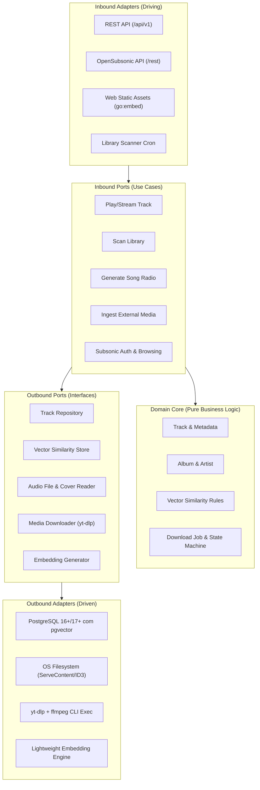
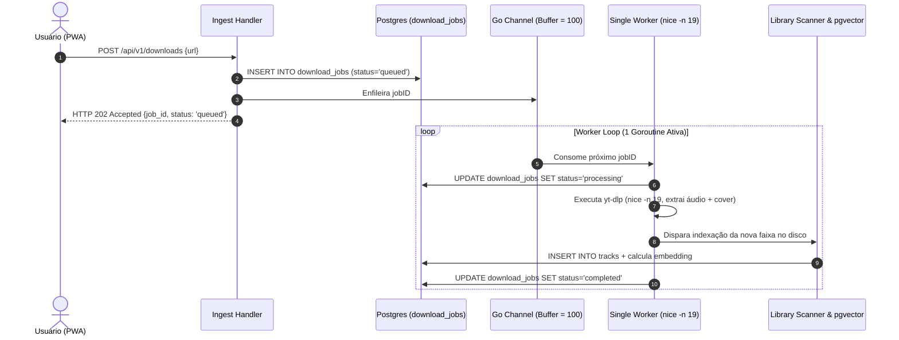
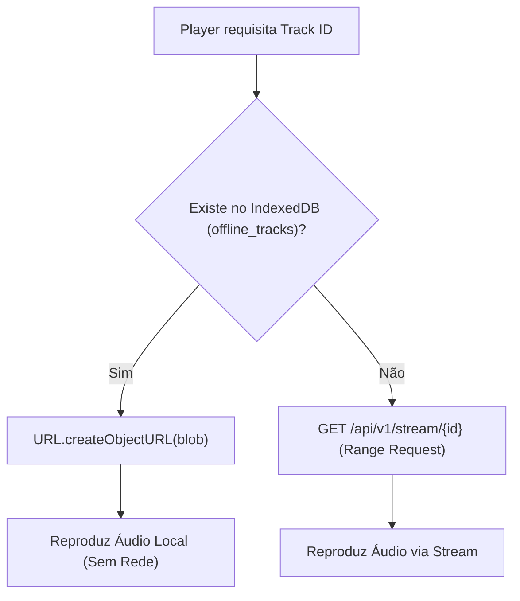

# Harmoni - Arquitetura de Software e Estrutura de Pastas

**Projeto:** Servidor de Áudio Self-Hosted Inteligente  
**Codinome:** *Harmoni*  
**Documento:** Especificação de Arquitetura de Software (Backend, Frontend e Pastas)  
**Padrões Centrais:** Clean Architecture, Hexagonal Architecture (Ports & Adapters), Domain-Driven Design (DDD) Tático, SOLID  
**Status:** Aprovado para Implementação  

---

## 1. Visão Geral da Arquitetura

O **Harmoni** foi concebido sob os princípios de **baixo acoplamento, alta coesão, testabilidade isolada e extrema eficiência de recursos** (pegada de RAM < 35 MB no backend). 

Para atender a esses requisitos sem criar complexidade acidental, adotamos uma abordagem de **Arquitetura Hexagonal (Ports & Adapters)** combinada com conceitos de **DDD Tático**, tanto no backend (Go) quanto no frontend (React/TypeScript).



---

## 2. Aplicação Rigorosa dos Princípios SOLID

### S — Single Responsibility Principle (Princípio da Responsabilidade Única)
* **Domain Models:** Contêm exclusivamente regras de negócio invariantes (ex.: cálculo de duração, validação de transições de status de download). Não contêm tags SQL, anotações de serialização HTTP ou referências ao sistema de arquivos.
* **HTTP Handlers:** Responsáveis apenas por parsear parâmetros da requisição, validar DTOs de entrada e serializar a resposta no formato esperado (JSON, XML para Subsonic ou Stream binário).
* **Use Cases / Services:** Orquestram fluxos de negócio específicos, chamando portas secundárias e regras de domínio.
* **Repositories:** Concentram unicamente instruções SQL e mapeamento relacional/vetorial com o PostgreSQL.

### O — Open/Closed Principle (Princípio Aberto/Fechado)
* O sistema é aberto para extensão e fechado para modificação através de interfaces nos limites da aplicação.
* Para adicionar um novo mecanismo de recomendação (ex.: Collaborative Filtering ou BM25) ou uma nova fonte de áudio externa (ex.: Bandcamp), cria-se um novo adapter que implementa a respectiva porta (`VectorStorePort` ou `DownloaderPort`), sem tocar no código de domínio ou nos Use Cases existentes.

### L — Liskov Substitution Principle (Princípio da Substituição de Liskov)
* Todas as implementações de portas são rigorosamente permutáveis.
* O `TrackRepository` pode ser implementado por `PostgresTrackRepository` em produção ou `InMemoryTrackRepository` em testes unitários automatizados, sem que nenhum comportamento esperado pelo Use Case seja violado.

### I — Interface Segregation Principle (Princípio da Segregação de Interfaces)
* Nenhuma interface monolítica é permitida. Em conformidade com as diretrizes idiomáticas de Go:
  * Em vez de um `TrackManager` gigante, usamos contratos mínimos:
    * `TrackReader` (`FindByID`, `Search`, `ListByAlbum`)
    * `TrackWriter` (`Save`, `Update`, `Delete`)
    * `TrackStreamer` (`OpenStream(id) (io.ReadSeekCloser, TrackFile, error)`)
    * `TrackVectorizer` (`FindSimilar(vector, limit, threshold) ([]Track, error)`)

### D — Dependency Inversion Principle (Princípio da Inversão de Dependência)
* **Regra de Dependência:** O domínio e os casos de uso dependem de abstrações (interfaces definidas na pasta `ports`), nunca de implementações concretas (PostgreSQL, `yt-dlp`, `net/http`).
* A injeção de dependência é realizada no ponto de composição inicial (`cmd/server/main.go`), ligando os adaptadores concretos às portas de entrada e saída.

---

## 3. Estrutura Completa de Pastas e Diretórios (Monorepo)

O projeto adota uma estrutura monorepo compacta e organizada:

```
harmoni/
├── cmd/
│   └── server/
│       └── main.go                 # Composition Root (Dependency Injection, Bootstrapping, Graceful Shutdown)
│
├── internal/                       # Código Go estritamente privado da aplicação
│   ├── core/                       # Núcleo da aplicação (Independente de frameworks e bancos)
│   │   ├── domain/                 # Entidades, Value Objects, Domain Errors e Regras de Negócio
│   │   │   ├── library/            # Subdomínio de Mídia: Track, Album, Artist, Genre
│   │   │   │   ├── entity.go
│   │   │   │   ├── value_objects.go
│   │   │   │   └── errors.go
│   │   │   ├── radio/              # Subdomínio de Recomendação Inteligente
│   │   │   │   ├── similarity.go
│   │   │   │   └── vector.go
│   │   │   └── ingest/             # Subdomínio de Download & Fila de Mídia
│   │   │       ├── job.go
│   │   │       └── status.go
│   │   │
│   │   ├── ports/                  # Contratos de Entrada (Driving) e Saída (Driven)
│   │   │   ├── inbound.go          # Use Cases (TrackUseCase, RadioUseCase, IngestUseCase, etc.)
│   │   │   └── outbound.go         # Repositórios e Serviços Externos (TrackRepo, Embedder, Downloader, etc.)
│   │   │
│   │   └── usecase/                # Implementação dos Casos de Uso (Orquestração do Domínio)
│   │       ├── library_scan.go     # Caso de uso: Varredura de disco e extração de tags
│   │       ├── track_stream.go     # Caso de uso: Obtenção de arquivo de áudio e validação de Range
│   │       ├── song_radio.go       # Caso de uso: Busca vetorial, penalização e fila contínua
│   │       ├── media_ingest.go     # Caso de uso: Enfileiramento e controle de download externo
│   │       └── subsonic_auth.go    # Caso de uso: Autenticação Token/Salt e compatibilidade OpenSubsonic
│   │
│   ├── adapters/                   # Adaptadores Técnicos de Entrada e Saída
│   │   ├── inbound/                # Adaptadores que acionam a aplicação (Driving)
│   │   │   ├── http/
│   │   │   │   ├── server.go       # Inicializador net/http, rotas Go 1.26+ e middlewares
│   │   │   │   ├── middleware/     # CORS, Auth, Logger slog, Panic Recovery, Rate Limit
│   │   │   │   ├── rest/           # Endpoints nativos Harmoni (/api/v1)
│   │   │   │   │   ├── track_handler.go
│   │   │   │   │   ├── stream_handler.go
│   │   │   │   │   ├── radio_handler.go
│   │   │   │   │   └── download_handler.go
│   │   │   │   ├── subsonic/       # Endpoints OpenSubsonic (/rest/*.view)
│   │   │   │   │   ├── auth_handler.go
│   │   │   │   │   ├── browser_handler.go
│   │   │   │   │   ├── stream_handler.go
│   │   │   │   │   └── xml_json_responder.go
│   │   │   │   └── web/            # Handler para servir o frontend embutido (go:embed)
│   │   │   │       └── embed_handler.go
│   │   │   │
│   │   │   └── worker/             # Consumidor de Fila em Background
│   │   │       └── download_worker.go # Worker único (chan limitado a 1) para chamadas throttled
│   │   │
│   │   └── outbound/               # Adaptadores consumidos pela aplicação (Driven)
│   │       ├── postgres/           # Implementação com pgx + pgvector
│   │       │   ├── client.go
│   │       │   ├── track_repository.go
│   │       │   ├── album_repository.go
│   │       │   ├── radio_repository.go
│   │       │   └── download_job_repository.go
│   │       ├── filesystem/         # Acesso seguro a disco e extração de tags
│   │       │   ├── audio_reader.go # io.ReadSeekCloser seguro (anti-Directory Traversal)
│   │       │   ├── tag_extractor.go# Leitura ID3/Vorbis Comments e capas locais
│   │       │   └── cover_cache.go  # Gerenciamento de capas e etags
│   │       ├── ytdlp/              # Wrapper para execução de processos do sistema
│   │       │   └── downloader.go   # exec.CommandContext com nice -n 19 e sanitização de URLs
│   │       └── embedding/          # Geração de vetores para o pgvector
│   │           └── generator.go    # Provedor de embeddings (local ou via API configurada)
│   │
│   └── platform/                   # Configuração e Utilitários Transversais
│       ├── config/                 # Carregamento de variáveis de ambiente (.env / flag)
│       │   └── config.go
│       ├── logger/                 # Configuração do slog estruturado
│       │   └── logger.go
│       └── database/               # Migrations e gerenciamento de pool de conexões
│           ├── migrations/         # Arquivos SQL de migração
│           │   └── 001_initial_schema.sql
│           └── migrator.go
│
├── web/                            # Frontend Single Page Application (PWA)
│   ├── public/                     # Manifest PWA, ícones adaptativos, favicons
│   │   ├── manifest.webmanifest
│   │   └── icons/
│   ├── src/
│   │   ├── domain/                 # Modelos tipados e entidades do frontend
│   │   │   ├── track.ts
│   │   │   ├── album.ts
│   │   │   ├── player.ts
│   │   │   └── download.ts
│   │   ├── adapters/               # Portas e Adaptadores no cliente (Comunicação e Armazenamento)
│   │   │   ├── api/                # Cliente HTTP tipado para o backend Go
│   │   │   │   ├── client.ts
│   │   │   │   └── endpoints.ts
│   │   │   ├── storage/            # Adaptador IndexedDB (offline tracks & metadata)
│   │   │   │   ├── db.ts           # Schema de IndexedDB
│   │   │   │   └── offline_store.ts
│   │   │   └── audio/              # Adaptador de hardware e áudio nativo
│   │   │       ├── audio_engine.ts # Wrapper para HTMLAudioElement / Web Audio
│   │   │       └── media_session.ts# Integração com navigator.mediaSession (telas bloqueadas/fones)
│   │   ├── features/               # Módulos funcionais coesos (Feature-Driven)
│   │   │   ├── player/             # Player Global, Fila, Controles e Waveform
│   │   │   │   ├── components/
│   │   │   │   ├── hooks/          # usePlayer, useAudioQueue
│   │   │   │   └── store/          # Zustand / State Store do Player (persistente entre rotas)
│   │   │   ├── library/            # Navegação de Artistas, Álbuns e Músicas
│   │   │   │   ├── components/
│   │   │   │   └── hooks/
│   │   │   ├── radio/              # Rádio inteligente e auto-continuidade
│   │   │   │   ├── components/
│   │   │   │   └── hooks/
│   │   │   └── downloads/          # Formulário de ingestão e monitoramento de fila
│   │   │       ├── components/
│   │   │       └── hooks/
│   │   ├── shared/                 # Componentes de UI reutilizáveis, design system e utils
│   │   │   ├── components/         # Botões, Modal, Drawer, Slider, LazyImage
│   │   │   └── utils/              # Formatadores de tempo, bytes, sanitização
│   │   ├── sw/                     # Service Worker para caching de assets estáticos
│   │   │   └── service-worker.ts
│   │   ├── App.tsx                 # Raiz da aplicação e layout persistente
│   │   ├── main.tsx                # Bootstrap React
│   │   └── index.css               # Estilização global e tokens de cor
│   ├── index.html
│   ├── package.json
│   ├── tsconfig.json
│   └── vite.config.ts
│
├── harmoni-prd.md                  # Requisitos do Produto (PRD)
├── harmoni-architecture.md         # Este documento de arquitetura
├── AGENTS.md                       # Protocolo e Guia Operacional para Agentes de IA
├── Dockerfile                      # Multi-stage build (Node -> Go 1.26 -> Alpine Slim)
├── docker-compose.yml              # Orquestração local e produção (Coolify Ready)
├── .env.example                    # Template de variáveis de ambiente
├── go.mod
├── go.sum
└── Makefile                        # Comandos de build, migração, testes e empacotamento
```

---

## 4. Arquitetura da API Backend (Go)

### 4.1. Camada de Domínio (`internal/core/domain`)

O domínio contém apenas código Go puro, sem importações de bibliotecas de terceiros ou frameworks.

#### Exemplo de Entidade de Mídia (`library/entity.go`):
```go
package library

import (
	"errors"
	"time"
)

var (
	ErrInvalidTrackDuration = errors.New("duração da faixa deve ser superior a zero")
	ErrEmptyFilePath        = errors.New("caminho do arquivo não pode ser vazio")
)

type TrackID string

type Track struct {
	ID          TrackID
	AlbumID     *string
	ArtistID    string
	Title       string
	TrackNumber int
	Duration    time.Duration
	FilePath    string
	FileFormat  string
	FileSize    int64
	Bitrate     int
	Genre       string
	CreatedAt   time.Time
}

func NewTrack(id TrackID, title string, duration time.Duration, path string, size int64, format string) (*Track, error) {
	if duration <= 0 {
		return nil, ErrInvalidTrackDuration
	}
	if path == "" {
		return nil, ErrEmptyFilePath
	}
	return &Track{
		ID:         id,
		Title:      title,
		Duration:   duration,
		FilePath:   path,
		FileSize:   size,
		FileFormat: format,
		CreatedAt:  time.Now().UTC(),
	}, nil
}
```

### 4.2. Definição de Portas (`internal/core/ports`)

As portas definem as interfaces pelas quais o mundo externo conversa com o núcleo (Inbound) e o núcleo conversa com sistemas externos (Outbound).

#### Portas de Entrada (Inbound Ports / Use Cases):
```go
package ports

import (
	"context"
	"io"
	"harmoni/internal/core/domain/ingest"
	"harmoni/internal/core/domain/library"
	"harmoni/internal/core/domain/radio"
)

type StreamResult struct {
	Content      io.ReadSeekCloser
	FileSize     int64
	FileFormat   string
	LastModified string
	ETag         string
}

type TrackUseCase interface {
	GetTrack(ctx context.Context, id library.TrackID) (*library.Track, error)
	StreamTrack(ctx context.Context, id library.TrackID) (*StreamResult, error)
	GetCoverArt(ctx context.Context, id library.TrackID) (io.ReadCloser, string, error)
}

type RadioUseCase interface {
	GenerateSongRadio(ctx context.Context, seedID library.TrackID, limit int, excludeArtistIDs []string) ([]library.Track, error)
}

type IngestUseCase interface {
	SubmitDownload(ctx context.Context, sourceURL string) (*ingest.DownloadJob, error)
	GetJobStatus(ctx context.Context, jobID string) (*ingest.DownloadJob, error)
}
```

#### Portas de Saída (Outbound Ports / Driven):
```go
package ports

import (
	"context"
	"io"
	"harmoni/internal/core/domain/ingest"
	"harmoni/internal/core/domain/library"
)

type TrackRepository interface {
	FindByID(ctx context.Context, id library.TrackID) (*library.Track, error)
	Save(ctx context.Context, track *library.Track) error
	ListAll(ctx context.Context, offset, limit int) ([]library.Track, error)
	FindSimilarByVector(ctx context.Context, vector []float32, limit int, excludedArtists []string) ([]library.Track, error)
}

type AudioFileStorage interface {
	OpenAudio(filePath string) (io.ReadSeekCloser, int64, error)
	ExtractCover(filePath string) (io.ReadCloser, string, error)
}

type DownloaderClient interface {
	Download(ctx context.Context, url string, outputDir string) (downloadedFilePath string, err error)
}

type EmbeddingService interface {
	GenerateEmbedding(ctx context.Context, text string) ([]float32, error)
}
```

### 4.3. Implementação de Casos de Uso (`internal/core/usecase`)

Orquestram regras de negócio sem acoplamento com protocolo de transporte (HTTP) ou motor de banco específico:

```go
package usecase

import (
	"context"
	"fmt"
	"harmoni/internal/core/domain/library"
	"harmoni/internal/core/ports"
)

type TrackService struct {
	repo    ports.TrackRepository
	storage ports.AudioFileStorage
}

func NewTrackService(repo ports.TrackRepository, storage ports.AudioFileStorage) *TrackService {
	return &TrackService{repo: repo, storage: storage}
}

func (s *TrackService) StreamTrack(ctx context.Context, id library.TrackID) (*ports.StreamResult, error) {
	track, err := s.repo.FindByID(ctx, id)
	if err != nil {
		return nil, fmt.Errorf("track não encontrada: %w", err)
	}

	reader, size, err := s.storage.OpenAudio(track.FilePath)
	if err != nil {
		return nil, fmt.Errorf("falha ao abrir áudio no disco: %w", err)
	}

	return &ports.StreamResult{
		Content:    reader,
		FileSize:   size,
		FileFormat: track.FileFormat,
		ETag:       fmt.Sprintf(`"%s-%d"`, track.ID, size),
	}, nil
}
```

### 4.4. Streaming de Alto Desempenho com `http.ServeContent`

Para manter o uso de RAM < 35 MB e permitir *seeking* instantâneo sem carregar arquivos inteiros em memória:

```go
// internal/adapters/inbound/http/rest/stream_handler.go
package rest

import (
	"net/http"
	"harmoni/internal/core/domain/library"
	"harmoni/internal/core/ports"
)

type StreamHandler struct {
	useCase ports.TrackUseCase
}

func NewStreamHandler(uc ports.TrackUseCase) *StreamHandler {
	return &StreamHandler{useCase: uc}
}

func (h *StreamHandler) ServeHTTP(w http.ResponseWriter, r *http.Request) {
	trackID := r.PathValue("id")
	if trackID == "" {
		http.Error(w, "id obrigatório", http.StatusBadRequest)
		return
	}

	res, err := h.useCase.StreamTrack(r.Context(), library.TrackID(trackID))
	if err != nil {
		http.Error(w, "áudio não encontrado", http.StatusNotFound)
		return
	}
	defer res.Content.Close()

	// Cabeçalhos essenciais para streaming
	w.Header().Set("Accept-Ranges", "bytes")
	w.Header().Set("ETag", res.ETag)

	// O Go cuida nativamente de responder com HTTP 206 Partial Content
	// e fatiar o reader conforme o cabeçalho 'Range: bytes=X-Y'
	http.ServeContent(w, r, string(trackID), time.Time{}, res.Content)
}
```

### 4.5. Worker de Download Throttled (Single-Worker Concurrency)

Garante que o processamento pesado do `yt-dlp` e `ffmpeg` não prejudique o streaming ao vivo nem estoure a CPU/RAM:



---

## 5. Arquitetura do Frontend (React + TypeScript + PWA)

### 5.1. Separação em Camadas e Features

O frontend divide-se em:
1. **Domain (`web/src/domain`):** Tipos puros do negócio musical (`Track`, `Album`, `QueueItem`, `PlaybackStatus`).
2. **Adapters (`web/src/adapters`):**
   - `api/`: Cliente de rede para consumir `/api/v1`.
   - `storage/`: Persistência local no `IndexedDB` com controle de cota via `navigator.storage.persist()`.
   - `audio/`: Motor de reprodução do HTML5 `<audio>` e Media Session API.
3. **Features (`web/src/features`):** Estrutura vertical por caso de uso (`player`, `library`, `radio`, `downloads`).
4. **Shared (`web/src/shared`):** Componentes agnósticos de UI.

### 5.2. Padrão de Repositório Híbrido (Online / Offline First)

O player não consome diretamente a rede. Ele interage com o `OfflineStorageAdapter` para decidir se toca direto do cache local (Blob) ou da rede:



### 5.3. Integração com Media Session API (Controles de Tela Bloqueada)

Isolado em um adapter reutilizável (`adapters/audio/media_session.ts`):
* Configura metadados de capa, título e artista para exibição em Smartwatches, fones Bluetooth e telas bloqueadas do Android/iOS.
* Responde a ações nativas de hardware: `play`, `pause`, `previoustrack`, `nexttrack`, `seekto`.

---

## 6. Comunicação e Contratos da API

### 6.1. Endpoints REST Harmoni (`/api/v1`)

| Método | Rota | Descrição |
| :--- | :--- | :--- |
| `GET` | `/api/v1/library/tracks` | Lista faixas com paginação e busca |
| `GET` | `/api/v1/library/albums` | Lista álbuns agrupados por artista |
| `GET` | `/api/v1/stream/{id}` | Streaming de áudio com suporte a `Range: bytes=` |
| `GET` | `/api/v1/covers/{id}` | Arte da capa em JPEG/PNG com cache HTTP agressivo |
| `GET` | `/api/v1/radio` | Retorna faixas similares a uma semente (`seed_track_id`) |
| `POST` | `/api/v1/downloads` | Enfileira URL externa para download |
| `GET` | `/api/v1/downloads/{id}` | Status do job de download |

### 6.2. Endpoints OpenSubsonic (`/rest/*.view`)

Compatíveis com clientes terceiros (Symfonium, Feishin, DSub):
* `/rest/ping.view`
* `/rest/getArtists.view`
* `/rest/getArtist.view`
* `/rest/getAlbum.view`
* `/rest/getSong.view`
* `/rest/stream.view`
* `/rest/getSimilarSongs.view` (alimentado pelo motor vetorial do Harmoni)

---

## 7. Estratégia de Testes e Reutilização de Código

1. **Testes Unitários de Domínio:** Sem mocks e sem I/O. Executam em milissegundos validando entidades e regras do Rádio Inteligente.
2. **Testes de Casos de Uso:** Mocks gerados a partir dos contratos de `ports` (`ports.TrackRepository`, etc.), validando a orquestração de negócios.
3. **Testes de Integração de Adapters:** Validação das queries SQL do `pgvector` usando instâncias de teste do Postgres e validação de `Range` HTTP com `httptest.Server`.
4. **Reutilização no Frontend:** O mesmo componente de exibição de lista de faixas (`TrackList`) é reutilizado na Biblioteca, no Resultado de Busca, na Fila do Player e no Álbum Offline.

---

## 8. Arquitetura de Deploy e Contêineres (Docker & Coolify)

### 8.1. Estratégia Multi-Stage no Dockerfile
O processo de build em contêiner é 100% autossuficiente e estruturado em 3 estágios:
1. **Stage 1 (Frontend Builder - Node 22 Alpine):** Compila os assets estáticos do React com Vite (`npm run build`), gerando a pasta `web/dist`.
2. **Stage 2 (Backend Builder - Go 1.26 Alpine):** Copia os artefatos estáticos de `web/dist` e compila o binário estático do Go com `go:embed`, stripping de símbolos de debug (`-ldflags="-s -w"`), gerando um executável único.
3. **Stage 3 (Runtime Final - Alpine Linux Slim):**
   * Contém apenas o binário compilado Go, `ca-certificates`, `tzdata`, `ffmpeg` e `yt-dlp`.
   * **Zero Node.js em execução.**
   * Consumo total de RAM em repouso < 35 MB.

### 8.2. Orquestração com Docker Compose e Compatibilidade com Coolify
O arquivo `docker-compose.yml` foi desenhado para ser imediatamente compatível com ambientes de orquestração self-hosted como **Coolify**, **Portainer** ou Docker puro:
* **PostgreSQL + pgvector:** Utiliza a imagem oficial `pgvector/pgvector:pg17` (ou `pg16`) com volume persistente para metadados e vetores HNSW.
* **Harmoni Core:** Conecta-se ao banco via rede interna e monta volumes para:
  * `/music`: Diretório de músicas locais do usuário (montado como leitura/escrita para permitir ingestão de downloads).
  * `/data`: Diretório para capas cacheadas, banco de dados temporário e downloads em andamento.
* **Healthchecks Nativos:** Permite que o Coolify monitore a saúde dos serviços via `pg_isready` e endpoint HTTP `/api/v1/health`.
* **Zero Config Drift:** Configuração totalmente declarativa guiada por variáveis de ambiente padronizadas no `.env.example`.

---

## 9. Protocolo para Agentes de IA (`AGENTS.md`)

Para garantir que novos desenvolvedores ou agentes autônomos de IA mantenham a integridade arquitetural do projeto sem violar os limites das camadas, consulte o documento:
* [AGENTS.md](file:///home/vitor/workspace/projetos/go/harmoni/AGENTS.md)

Este guia estabelece:
* Checklist passo a passo para implementação de qualquer nova feature.
* Diretrizes inegociáveis de isolamento de camadas (Domain vs Adapters).
* Padrões de código Go 1.26 e React/TypeScript.
* Regras de concorrência e streaming sem transcodificação.

